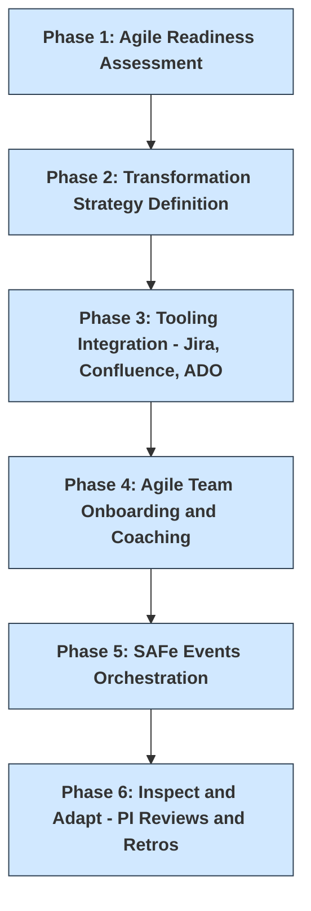

# Enterprise Agile Transformation at Capital One

## Summary
This project represents a successful multi-year Agile transformation initiative at Capital One within the Card Tech division. As a senior Agile delivery leader, I helped drive scaled execution across product teams by introducing Lean Agile best practices, engineering-led governance, and data-driven planning—laying the foundation for enterprise-wide agility.

---

## 🚨 Problem → 💡 Solution → 📈 Impact

### Problem
Card Tech struggled with delivery predictability, inconsistent backlog grooming, and feature delays across Agile teams working within SAFe trains. Stakeholder confidence and team alignment were diminishing due to unclear ownership and ad hoc prioritization.

### Solution
- Introduced **Lean Agile feature intake and refinement workflow**.
- Created a **Capacity Planning Model** to enable right-sizing and accurate forecasting of delivery teams.
- Mentored Product Owners, Scrum Masters, and RTEs in **Scaled Agile (SAFe) practices**.
- Led ceremonies including **PI Planning, Scrum of Scrums, System Demo, PO Sync**, and implemented cross-team dependency management.

### Impact
- 🕒 Reduced feature cycle time to under 45 days (from 75+).
- 📊 Improved predictability in planning with visible KPIs (velocity, carryover, burn-down).
- 🤝 Elevated stakeholder trust with clear reporting and outcome-focused dashboards.
- 📈 Increased Agile maturity scores across teams.

---

## 🛠️ Practices & Tools

| Area                         | Tools / Frameworks              |
|-----------------------------|----------------------------------|
| Agile Scaling Framework     | SAFe (Scaled Agile Framework)   |
| Backlog Management          | Jira, Jira Align, Confluence    |
| Reporting                   | Velocity Charts, Burn-downs, MSRs |
| Dependency Management       | Scrum of Scrums, RTE Syncs      |
| Capacity Planning           | Custom-built Excel models       |
| Team Coaching               | SAFe SPC, RTE-led facilitation  |

---

## 📐 Transformation Roadmap

---

## 👤 Role & Leadership

As **Senior Agile Delivery Leader**, I owned the Agile execution model across several ARTs (Agile Release Trains), led team coaching, and facilitated cross-functional planning and performance tracking.

---

## ✅ Status

🟢 Fully operational with reusable playbooks and dashboard templates now used across enterprise programs.
