# Career Track Portfolio Summary

As a senior technology leader with 25+ years of experience, my portfolio showcases enterprise-scale innovations across Agile transformation, AI architecture, and information security compliance—highlighting a trajectory toward the Technical Executive role. Each case study reflects my ability to blend strategic vision with hands-on technical execution.

---

## Key Highlights

-  AI-Driven Innovation  
  Architected an enterprise-grade AI knowledge base using **Retrieval-Augmented Generation (RAG)** with OpenAI, LangChain, Flask, and Azure Cognitive Search.  
  ✅ Automated HR query handling, reducing operational workload by **over 60%**.

-  Enterprise Agile Transformation  
  Led multi-team Agile scaling initiatives at Capital One, embedding SAFe practices and engineering governance.  
  ✅ Improved delivery predictability and reduced cycle time across product teams.

-  ISO 27001 Certification Readiness  
  Directed a full ISO 27001 audit and certification program, aligning IT and business with enterprise risk frameworks.  
  ✅ Established repeatable compliance governance models.

---

## What This Portfolio Demonstrates

- Proven ability to deliver strategic technical outcomes aligned with business goals  
- Deep expertise in AI/ML, Cloud, Agile at Scale, Risk & Compliance**  
- Cross-functional leadership and executive collaboration  
- Technical fluency in modern development stacks, DevOps, and secure architecture

---

## Career Track Portfolio Map

```mermaid
graph TD
    Start[CTO-Track Portfolio]

    subgraph Initiatives
        AI[AI-Driven Knowledge Base<br><small>RAG, LangChain, GPT</small>]
        AG[Agile Transformation<br><small>SAFe, Governance</small>]
        ISO[ISO 27001 Readiness<br><small>Compliance & Audit</small>]
    end

    subgraph Outcomes
        O1[📉 60% HR Workload Reduction]
        O2[⚡ Faster Delivery & Predictability]
        O3[✅ ISO Certification Achieved]
    end

    subgraph Capabilities
        C1[🔧 Technical Execution]
        C2[📊 Strategic Delivery]
        C3[🔐 Risk & Compliance Management]
    end

    AI --> O1 --> C1
    AG --> O2 --> C2
    ISO --> O3 --> C3

    C1 --> CTO[🚀 CTO-Ready Leadership]
    C2 --> CTO
    C3 --> CTO

    Start --> AI
    Start --> AG
    Start --> ISO
```

---

