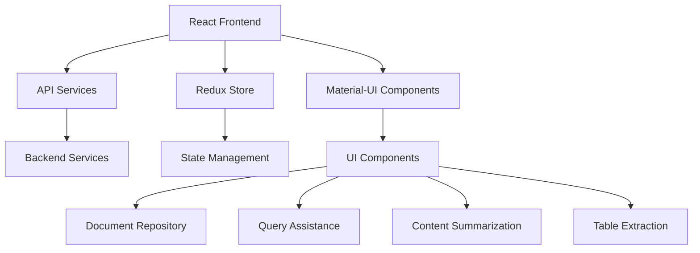

# Empathiq Knowledge Platform Frontend

## Technical Architecture

### Overview
The Empathiq Knowledge Platform is a React-based web application that provides document management, query assistance, content summarization, and table extraction capabilities. The application follows a modern frontend architecture with Material-UI for styling and Redux for state management.

### System Architecture Diagram


### Technology Stack
- **Frontend Framework**: React 18.3.1
- **State Management**: Redux Toolkit
- **UI Framework**: Material-UI (MUI) 6.1.1
- **Routing**: React Router DOM 6.26.2
- **HTTP Client**: Axios
- **Authentication**: Azure MSAL
- **Data Visualization**: Chart.js
- **Animation**: Framer Motion
- **Document Processing**: 
  - XLSX for Excel operations
  - jsPDF for PDF generation
  - html2canvas for table capture

### Key Features
1. **Document Repository**
   - File management and selection
   - Document list refresh capability
   - Secure file access

2. **Query Assistance**
   - Natural language query processing
   - Voice input support
   - Response formatting and display

3. **Content Summarization**
   - Document summarization
   - Technical content analysis
   - Summary presentation

4. **Table Extraction**
   - Automated table detection
   - Table data extraction
   - Export capabilities (Excel/PDF)

### Project Structure
```
src/
├── components/         # React components
├── services/          # API services
├── store/            # Redux store configuration
├── utils/            # Utility functions
├── icons/            # Application icons
└── App.css           # Global styles
```

### Development Setup
1. **Prerequisites**
   - Node.js (Latest LTS version)
   - npm or yarn

2. **Installation**
   ```bash
   npm install
   ```

3. **Running the Application**
   ```bash
   npm start
   ```

4. **Building for Production**
   ```bash
   npm run build
   ```

### API Integration
The frontend communicates with backend services through RESTful APIs:
- `/ask` - Query processing
- `/summarize` - Document summarization
- `/extractTables` - Table extraction
- `/getfilenames` - File metadata retrieval

### Security
- Azure AD authentication integration
- Secure API communication
- Protected routes and resources

### Performance Considerations
- Lazy loading of components
- Optimized bundle size
- Efficient state management
- Responsive design implementation

### Deployment
The application can be deployed using:
- Docker containerization
- Static file hosting
- CI/CD pipeline integration

### Browser Support
- Chrome (latest)
- Firefox (latest)
- Safari (latest)
- Edge (latest) 
